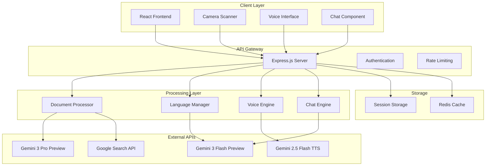

# Design Document: Sahaj AI - The Universal Paperwork Decoder

## Overview

Sahaj AI is a web-based application that transforms complex government documents into accessible, multilingual guides for Indian citizens. The system leverages Google's Gemini API ecosystem to provide document analysis, multilingual support, voice interaction, and contextual assistance. The architecture follows a client-server model with a React-based frontend and Node.js backend, emphasizing accessibility, mobile optimization, and real-time processing.

## Architecture

### High-Level Architecture



### Component Architecture

The system is organized into distinct layers:

1. **Presentation Layer**: React-based UI with accessibility-first design
2. **API Layer**: Express.js server handling requests and orchestrating services
3. **Processing Layer**: Specialized services for document analysis, language management, and voice processing
4. **Integration Layer**: Connectors to Google Gemini APIs and external services
5. **Data Layer**: Session management and caching for performance optimization

## Components and Interfaces

### Frontend Components

#### DocumentUploader
- **Purpose**: Handles file uploads and camera scanning
- **Key Methods**:
  - `uploadFile(file: File): Promise<UploadResponse>`
  - `startCameraCapture(): Promise<MediaStream>`
  - `captureDocument(): Promise<Blob>`
- **Dependencies**: getUserMedia API, File API
- **Accessibility**: Keyboard navigation, screen reader support, high contrast mode

#### LanguageSwitcher
- **Purpose**: Manages multilingual interface transitions
- **Key Methods**:
  - `switchLanguage(languageCode: string): void`
  - `getAvailableLanguages(): Language[]`
  - `translateInterface(languageCode: string): Promise<void>`
- **State Management**: Redux store for global language state
- **Supported Languages**: EN, HI, BN, MR, GJ, TA

#### VoiceInterface
- **Purpose**: Handles voice input/output interactions
- **Key Methods**:
  - `startListening(languageCode: string): Promise<string>`
  - `speak(text: string, languageCode: string): Promise<void>`
  - `toggleAutoSpeak(enabled: boolean): void`
- **Dependencies**: Web Speech API, Gemini TTS API
- **Error Handling**: Graceful fallback to text input

#### ChatAssistant
- **Purpose**: Provides contextual document-based conversations
- **Key Methods**:
  - `sendMessage(message: string): Promise<ChatResponse>`
  - `initializeContext(documentAnalysis: DocumentAnalysis): void`
  - `updateLanguage(languageCode: string): void`
- **Context Management**: Maintains document analysis as system context
- **Session Handling**: Persistent conversation state

#### ProgressTracker
- **Purpose**: Visual feedback for document processing stages
- **Key Methods**:
  - `updateStage(stage: ProcessingStage): void`
  - `setProgress(percentage: number): void`
  - `showError(error: ProcessingError): void`
- **Stages**: Structure Analysis, Legal Interpretation, Simplification, Translation, Resource Grounding
- **Animation**: Smooth transitions with accessibility considerations

### Backend Services

#### DocumentAnalysisService
- **Purpose**: Orchestrates document processing pipeline
- **Key Methods**:
  - `analyzeDocument(file: Buffer, mimeType: string): Promise<DocumentAnalysis>`
  - `extractStructure(document: Buffer): Promise<DocumentStructure>`
  - `simplifyTerms(terms: LegalTerm[]): Promise<SimplifiedTerm[]>`
- **Integration**: Gemini 3 Pro Preview API
- **Output Format**: Structured JSON with field names, original terms, simplified explanations, required actions

#### LanguageService
- **Purpose**: Manages translations and multilingual content
- **Key Methods**:
  - `translateContent(content: string, targetLanguage: string): Promise<string>`
  - `getLanguageSpecificVoice(languageCode: string): VoiceProfile`
  - `validateLanguageSupport(languageCode: string): boolean`
- **Translation Engine**: Gemini 3 Flash Preview for contextual translations
- **Voice Profiles**: Language-specific TTS configurations

#### VoiceService
- **Purpose**: Handles text-to-speech and speech-to-text operations
- **Key Methods**:
  - `synthesizeSpeech(text: string, voiceProfile: VoiceProfile): Promise<AudioBuffer>`
  - `transcribeSpeech(audioBuffer: Buffer, languageCode: string): Promise<string>`
  - `getVoiceCapabilities(languageCode: string): VoiceCapabilities`
- **TTS Engine**: Gemini 2.5 Flash TTS with multilingual support
- **Quality**: Studio-quality voice synthesis with emotional control

#### SearchService
- **Purpose**: Finds relevant government resources and links
- **Key Methods**:
  - `findGovernmentPortals(documentType: string): Promise<GovernmentResource[]>`
  - `verifyLinkAuthenticity(url: string): Promise<boolean>`
  - `searchRelatedForms(keywords: string[]): Promise<RelatedForm[]>`
- **Integration**: Google Search API with government domain filtering
- **Verification**: Link authenticity validation for security

#### ChecklistService
- **Purpose**: Generates actionable task lists from document analysis
- **Key Methods**:
  - `generateChecklist(analysis: DocumentAnalysis): Promise<ActionChecklist>`
  - `prioritizeActions(actions: RequiredAction[]): RequiredAction[]`
  - `formatForPrint(checklist: ActionChecklist): Promise<PrintableDocument>`
- **Organization**: Priority-based action ordering with dependency tracking
- **Export**: Print-friendly formatting with accessibility compliance

## Data Models

### Core Data Structures

```typescript
interface DocumentAnalysis {
  id: string;
  originalDocument: DocumentMetadata;
  extractedFields: ExtractedField[];
  simplifiedTerms: SimplifiedTerm[];
  requiredActions: RequiredAction[];
  governmentResources: GovernmentResource[];
  processingStages: ProcessingStage[];
  createdAt: Date;
  languageCode: string;
}

interface ExtractedField {
  fieldName: string;
  originalTerm: string;
  simplifiedExplanation: string;
  fieldType: 'text' | 'signature' | 'date' | 'attachment' | 'selection';
  isRequired: boolean;
  validationRules?: ValidationRule[];
}

interface SimplifiedTerm {
  originalTerm: string;
  simplifiedTerm: string;
  explanation: string;
  examples?: string[];
  relatedActions: string[];
}

interface RequiredAction {
  id: string;
  description: string;
  priority: 'high' | 'medium' | 'low';
  actionType: 'signature' | 'attachment' | 'information' | 'submission';
  dependencies: string[];
  estimatedTime: number; // in minutes
  instructions: string[];
}

interface GovernmentResource {
  title: string;
  url: string;
  description: string;
  resourceType: 'portal' | 'form' | 'guide' | 'contact';
  verificationStatus: 'verified' | 'pending' | 'failed';
  lastUpdated: Date;
}

interface VoiceProfile {
  languageCode: string;
  voiceId: string;
  gender: 'male' | 'female' | 'neutral';
  speed: number;
  pitch: number;
  emotionalTone: 'neutral' | 'friendly' | 'professional';
}

interface ChatContext {
  documentAnalysis: DocumentAnalysis;
  conversationHistory: ChatMessage[];
  currentLanguage: string;
  userPreferences: UserPreferences;
}

interface ProcessingStage {
  name: string;
  status: 'pending' | 'in_progress' | 'completed' | 'failed';
  progress: number; // 0-100
  estimatedTimeRemaining?: number; // in seconds
  errorMessage?: string;
}
```

### Language Support Structure

```typescript
interface LanguageConfiguration {
  code: string; // EN, HI, BN, MR, GJ, TA
  name: string;
  nativeName: string;
  direction: 'ltr' | 'rtl';
  voiceProfiles: VoiceProfile[];
  translationEngine: 'gemini' | 'fallback';
  supportLevel: 'full' | 'partial';
}

interface TranslationCache {
  sourceText: string;
  targetLanguage: string;
  translatedText: string;
  confidence: number;
  cachedAt: Date;
  expiresAt: Date;
}
```

## Error Handling

### Error Classification

1. **User Input Errors**
   - Invalid file formats
   - Corrupted or unreadable documents
   - Unsupported languages
   - Camera access denied

2. **Processing Errors**
   - API rate limits exceeded
   - Document analysis failures
   - Translation service unavailable
   - Voice synthesis failures

3. **System Errors**
   - Network connectivity issues
   - Service timeouts
   - Authentication failures
   - Storage limitations

### Error Recovery Strategies

#### Graceful Degradation
- **Document Analysis**: Fallback to basic OCR if advanced analysis fails
- **Voice Features**: Text-only mode when voice services unavailable
- **Translation**: English fallback with user notification
- **Camera Scanning**: File upload alternative always available

#### User Communication
- **Error Messages**: Localized, clear explanations in user's selected language
- **Recovery Actions**: Specific steps users can take to resolve issues
- **Progress Preservation**: Save partial progress during failures
- **Support Channels**: Clear escalation paths for unresolved issues

#### Retry Mechanisms
- **Exponential Backoff**: For API failures and network issues
- **Circuit Breaker**: Prevent cascade failures in service dependencies
- **Queue Management**: Handle high-load scenarios gracefully
- **Timeout Handling**: Reasonable timeouts with user feedback

## Testing Strategy

### Dual Testing Approach

The testing strategy combines unit tests for specific functionality with property-based tests for comprehensive validation across diverse inputs and scenarios.

#### Unit Testing Focus
- **Component Integration**: Verify proper interaction between frontend components
- **API Endpoints**: Test specific request/response scenarios
- **Error Conditions**: Validate error handling for known failure cases
- **Edge Cases**: Test boundary conditions and unusual inputs
- **Accessibility**: Verify WCAG compliance and keyboard navigation

#### Property-Based Testing Focus
- **Document Processing**: Validate analysis consistency across document types
- **Language Translation**: Ensure translation quality and consistency
- **Voice Synthesis**: Verify audio quality across languages and content types
- **User Interface**: Test responsive behavior across devices and screen sizes
- **Data Integrity**: Validate data consistency throughout processing pipeline

#### Testing Configuration
- **Property Test Iterations**: Minimum 100 iterations per property test
- **Test Library**: Jest with fast-check for property-based testing
- **Coverage Requirements**: 90% code coverage for critical paths
- **Performance Testing**: Load testing for concurrent document processing
- **Accessibility Testing**: Automated testing with axe-core and manual validation

#### Test Environment Setup
- **Mock Services**: Comprehensive mocking of external APIs for unit tests
- **Test Data**: Diverse document samples across languages and complexity levels
- **Device Testing**: Cross-browser and mobile device compatibility testing
- **Internationalization Testing**: Validation across all supported languages

## Correctness Properties

*A property is a characteristic or behavior that should hold true across all valid executions of a system—essentially, a formal statement about what the system should do. Properties serve as the bridge between human-readable specifications and machine-verifiable correctness guarantees.*

### Property 1: Document Analysis Completeness
*For any* valid PDF or image document uploaded to the system, the Document_Analyzer should extract and return all four required components: field names, original terms, simplified explanations, and required actions in a structured format
**Validates: Requirements 1.1, 1.3, 2.5**

### Property 2: Language Switching Consistency  
*For any* language change operation, the entire system (UI, chat context, and document breakdowns) should instantly update to the selected language while preserving all functional state and conversation context
**Validates: Requirements 2.2, 2.3, 4.3**

### Property 3: Multilingual Voice Interface Completeness
*For any* supported language (EN, HI, BN, MR, GJ, TA), the voice interface should provide both speech-to-text input capture and text-to-speech output generation with language-appropriate voice profiles
**Validates: Requirements 3.1, 3.2, 3.4**

### Property 4: Processing Stage Progression
*For any* document processing operation, the Progress_Tracker should display exactly five stages (Structure Analysis, Legal Interpretation, Simplification, Translation, Resource Grounding) in sequential order with accurate progress updates
**Validates: Requirements 1.2, 9.1, 9.2**

### Property 5: Error Handling Graceful Degradation
*For any* system failure (unreadable documents, voice processing errors, API failures), the system should provide clear error messages and functional fallback options without losing user progress
**Validates: Requirements 1.4, 3.5, 9.4**

### Property 6: Upload Method Dual Support
*For any* document input scenario, both drag-and-drop file upload and mobile camera scanning via getUserMedia() should be available and functional across supported browsers
**Validates: Requirements 1.5, 8.5**

### Property 7: Language Support Exactness
*For any* language selection operation, the system should support exactly six languages (EN, HI, BN, MR, GJ, TA) with consistent terminology translations across all interface elements
**Validates: Requirements 2.1, 2.4**

### Property 8: Contextual Chat Accuracy
*For any* user query about an uploaded document, the Chat_Assistant should provide responses that reference specific sections of that document's analysis rather than generic information
**Validates: Requirements 4.1, 4.2, 4.4, 4.5**

### Property 9: Checklist Generation Completeness
*For any* document analysis, the generated checklist should include all required actions organized by priority and dependency order, with specific requirement details and interactive checkboxes in a print-friendly format
**Validates: Requirements 5.1, 5.2, 5.3, 5.4, 5.5**

### Property 10: Government Resource Integration
*For any* analyzed document, the system should search for, verify, and present relevant government portals and filing links organized by relevance, with alternative contact methods when links are unavailable
**Validates: Requirements 6.1, 6.2, 6.3, 6.4, 6.5**

### Property 11: Accessibility Compliance
*For any* user interface element, the system should maintain WCAG 2.1 AA compliance with high-contrast Inter typography, keyboard navigation support, and the specified color scheme (#4f46e6, #7c3aed)
**Validates: Requirements 7.1, 7.2, 7.4, 7.5**

### Property 12: Camera Interface Usability
*For any* mobile camera scanning operation, the interface should provide live preview, document detection guidelines, visual positioning feedback, and review/retake functionality across different browsers and orientations
**Validates: Requirements 8.1, 8.2, 8.3, 8.4, 8.5**

### Property 13: Auto-Speak Behavior
*For any* chat response when auto-speak is enabled, the Voice_Engine should automatically generate and play speech using the appropriate language-specific voice profile
**Validates: Requirements 3.3**

### Property 14: Progress Time Estimation
*For any* document processing operation, the Progress_Tracker should provide realistic time estimates that update as processing progresses and handle delays with appropriate user communication
**Validates: Requirements 9.3, 9.4**

### Property 15: Visual Design Consistency
*For any* user interface component, the design should maintain visual consistency with smooth micro-animations, proper whitespace, and the specified design system throughout the application
**Validates: Requirements 7.3, 9.5**

### Property 16: Data Security Round-Trip
*For any* uploaded document, the system should encrypt the document during transmission and processing, then automatically delete it after session completion without storing extracted personal information
**Validates: Requirements 10.1, 10.2, 10.3**

### Property 17: Privacy Transparency
*For any* sensitive data processing operation, the system should provide clear privacy notices and maintain compliance with Indian data protection regulations
**Validates: Requirements 10.4, 10.5**